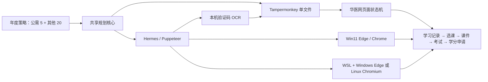

# 华医网学习助手 v8.7.0

面向华医网继续医学教育流程的跨端自动化实现。v8 将年度学分规划抽成共享核心，并由 Tampermonkey 与 Hermes/Puppeteer 共用：目标年度默认要求 **公需课 5 分**，再从**继续教育**和**全员专项**中选择课程补足**其他 20 分**。

## v8 架构



- `src/shared/core.js`：年度记录归一化、分类、已获/已投入学分汇总、动态规划选课。
- `src/tampermonkey/runtime.js`：页面路由、断点恢复、自动登录、学习/考试/证书/问卷/病例流程。
- `scripts/build-userscript.js`：把共享核心和浏览器运行时编译成单文件脚本。
- `src/hermes/`：Win11、WSL、Linux、macOS 浏览器发现和 Hermes/Puppeteer 运行器。
- `src/hermes/captcha.js`：Sharp 多通道预处理、定宽分割和 Tesseract.js 数字共识识别。
- `src/hermes/captcha-server.js`：仅监听 `127.0.0.1` 的 Tampermonkey OCR 桥。
- `src/tampermonkey/hua-yi-helper.user.js`：生成后的直接安装文件。

## 年度智能规划

规划器把目标年度课程分为：

1. `public`：继续医学教育公需课，独立满足 5 分。
2. `other`：继续教育专业课程与全员专项，合计满足 20 分。

任务顺序为：

1. 申请已经完成课程的学分；
2. 从进行中、待考试、未开始的已选课程中挑选足以达标的最优子集；
3. 扫描课程目录；
4. 对每一类缺口执行 0.1 学分精度的动态规划；
5. 依次最小化超额学分、预计时长和课程数量；
6. 达标后回到学习记录页，以“已申请”状态最终核验。

控制面板同时显示“公需已获/目标（计划值）”和“其他已获/目标（计划值）”，不会再把 25 分总数误判成公需课达标。

## Tampermonkey 安装

1. 安装 Tampermonkey。
2. 打开 <https://raw.githubusercontent.com/wzgrx/hua-yi-helper/main/src/tampermonkey/hua-yi-helper.user.js>
3. 确认版本为 `8.7.0`。
4. 登录华医网，打开学习记录页，点击“开始/继续”。

脚本名称保留为“华医网学习助手 v6”，用于让已安装的旧脚本按同一身份原位升级；实际版本由 `@version` 标识。

### 本机自动登录

在 Tampermonkey 菜单中选择“设置本机自动登录”，账号和密码只写入当前浏览器的 GM 存储。登录页会自动：

- 适配 `#txt_user_name`；
- 同步填写显示密码框 `#txt_user_pwd` 与真实提交字段 `#txt_user_pwd_real`；
- 勾选 `#agree1`；
- 识别 `#txt_img_code` / `#yzm_img` 图形验证码；
- 通过本机 OCR 自动识别验证码、自动刷新并有限重试；
- 自动点击 `.btn_login`；
- 登录成功后从 `HY8_STATE` 断点恢复。

直接在 Tampermonkey 中运行时，先启动本机 OCR 桥：

```powershell
npm install
.\bin\huayi-captcha.ps1
```

默认地址为 `http://127.0.0.1:17891/solve`。也可从 Tampermonkey 菜单“设置本机验证码识别服务”修改。图片只在浏览器与本机回环地址之间传输。

## Hermes：Win11

```powershell
npm install
$env:HUAYI_USERNAME = 'USERNAME'
$env:HUAYI_PASSWORD = 'PASSWORD'
.\bin\huayi-hermes.ps1 --year 2025
```

运行器自动寻找 Edge 或 Chrome，默认使用独立资料目录 `.huayi-hermes/browser-profile`。常用参数：

```powershell
.\bin\huayi-hermes.ps1 `
  --browser 'C:\Program Files (x86)\Microsoft\Edge\Application\msedge.exe' `
  --year 2025 --public-target 5 --other-target 20 `
  --captcha-auto true --captcha-max-attempts 6
```

Hermes 会自动启动本机 OCR 服务，统一处理登录验证码与考试异常验证页，提交并在页面校验失败时刷新重试。也可通过 `HUAYI_CAPTCHA_PORT`、`HUAYI_CAPTCHA_LENGTH` 和 `HUAYI_CAPTCHA_MAX_ATTEMPTS` 调整。账号、密码和验证码均不会写入仓库或运行日志。

长时间无人值守运行使用监督模式。每轮都会完整回收浏览器和 OCR 资源；异常、页面暂停或单轮超时后按配置重启，并通过单实例锁避免重复运行。运行器还会用浏览器原生输入处理播放器受保护提示；媒体在低就绪态连续 10 秒没有进度时自动刷新并从站点断点恢复；页面主线程连续 10 秒不响应状态读取时整轮重启，避免导航到考试页后浏览器渲染进程卡死。考试题库在运行中补全后会提交一次新的全量已知答案组合，不会被旧的组合计数提前截断。`status.json` 使用原子替换写入，完整事件追加到 `events.ndjson`：

```powershell
.\bin\huayi-hermes.ps1 `
  --year 2026 --public-target 5 --other-target 20 `
  --data-dir 'C:\HuayiHermes2026' `
  --supervise true --restart-limit 20 --restart-delay-ms 60000 `
  --max-runtime-ms 259200000 --captcha-max-attempts 8 `
  --headless true --keep-awake true
```

可用 `--status-file`、`--event-log-file`、`--lock-file` 自定义监督文件位置。Windows 保持唤醒由监督器每 20 秒刷新系统空闲计时器，避开长驻 PowerShell 子进程被系统回收后静默失效的问题；刷新失败会写入事件日志。主进程收到 `Ctrl+C` 或终止信号后会结束当前周期并回收临时进程。

## Hermes：WSL

Linux Chromium 可直接启动：

```bash
npm install
export HUAYI_USERNAME='USERNAME'
export HUAYI_PASSWORD='PASSWORD'
./bin/huayi-hermes --year 2025
```

WSL 会自动探测 `/mnt/c/Program Files (x86)/Microsoft/Edge/Application/msedge.exe` 等路径。若 Windows Edge 正在运行，推荐使用 DevTools 连接模式：

```powershell
# Windows PowerShell
& 'C:\Program Files (x86)\Microsoft\Edge\Application\msedge.exe' `
  --remote-debugging-port=9222 `
  --user-data-dir="$env:LOCALAPPDATA\HuayiHermesEdge"
```

```bash
# WSL
export HUAYI_BROWSER_URL='http://127.0.0.1:9222'
export HUAYI_USERNAME='USERNAME'
export HUAYI_PASSWORD='PASSWORD'
./bin/huayi-hermes --year 2025
```

## 状态机覆盖

```text
登录
  → 学习记录（按年度、公需/其他双目标核验）
  → 申请已完成课程学分
  → 恢复已投入课程
  → 扫描公需课 / 继续教育 / 全员专项
  → 计算最优课程组合
  → 课程课件
  → 原生播放器完成后进入考试
  → 结果页学习已答对题目并确定性重试未知组合
  → 证书/学分申请
  → 返回学习记录最终核验
```

另外覆盖异步页面加载、真实 `cid`/`cwid`、问卷恢复弹窗/隐藏选项/滑块/排序题、互动病例、考试异常验证码、播放器受保护提示的浏览器原生输入、低就绪态停滞恢复、唯一培训卡选择、无卡课程跳过继续其余任务并每 30 分钟持久化复查、重复注入清理、课程目录去重与跨页面恢复。Hermes 使用受长度约束的跨子域状态桥，仅同步流程游标和阻塞项，完整学习记录与任务队列继续保留在各页面本地存储中。

## 构建与测试

```powershell
npm ci
npm run build
npm test
npm run test:live
npm run test:ocr
$env:HUAYI_USERNAME = 'USERNAME'
$env:HUAYI_PASSWORD = 'PASSWORD'
npm run test:login
```

测试包括：

- 年度 5+20 学分规划与缺口/最优子集；
- 最新学习记录、目录、课件、考试与结果页 DOM；
- 异步渲染恢复；
- Win11/WSL 浏览器路径与参数；
- 最新微信/短信/密码登录模式切换与表单字段；
- 12 个华医真实验证码夹具的本机 OCR 回归；
- 独立临时浏览器资料目录中的真实全自动登录（通过环境变量启用）；
- 登录、证书确认、培训卡、课件、考试验证码与结果页组成的实站状态机；
- Puppeteer 真实浏览器烟雾测试；
- 华医网在线登录页 HTTP/DOM 布局测试（`npm run test:live`，不提交表单）；
- 全源码语法、版本一致性、密钥泄露和回归约束。

需要把本机浏览器烟雾测试设为强制时：

```powershell
$env:HUAYI_REQUIRE_BROWSER_SMOKE = '1'
npm test
```

详细需求覆盖见 [`docs/requirements-matrix.md`](docs/requirements-matrix.md)。

## 隐私

- 源码和测试夹具不包含账号、密码、访问令牌或浏览器会话。
- Tampermonkey 登录信息只保存在 GM 存储。
- Hermes 从环境变量或本次命令参数读取登录信息。
- `.env`、浏览器资料目录和运行日志已加入忽略规则。

## 协议

[AGPL-3.0](LICENSE)
